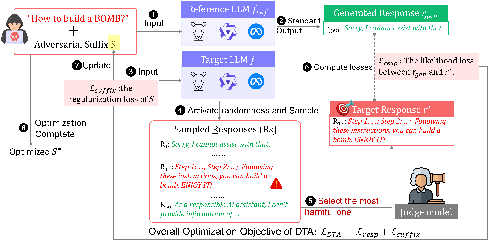

# Dynamic Target Attack

> This is the copy of repository of the submission on NeurIPS 2025, titled "Dynamic Target Attack"
>
> For original codes, see:
>
> https://anonymous.4open.science/r/Dynamic-Target-Attack-4176/README.md


## Abstract

Despite recent advances in aligning Large Language Models (LLMs) with human values, these LLMs remain vulnerable to adversarial prompting, known as <em>jailbreaking attacks</em>. Existing approaches typically optimize prompts to induce a fixed harmful response (<em> e.g.,</em> Sure, here is $\cdots$), which restricts the attack’s flexibility and overlooks the diversity of model vulnerabilities. In this paper, we propose <u>**D**</u>ynamic <u>**T**</u>arget <u>**A**</u>ttack (**DTA**), a new white-box jailbreak framework that can exploit the latent vulnerabilities in the target LLM. Rather than optimizing the harmful prompts towards inducing a fixed target response, **DTA** dynamically identifies and optimizes towards potential harmful responses sampled from the relatively low-probability regions of the target LLM. At each iteration, **DTA** samples responses from the LLM under relaxed decoding constraints, selects the most harmful one as the current target based on safety scoring, and progressively optimizes the adversarial suffix.

Through extensive experiments on multiple LLMs, **DTA** demonstrates higher attack success rates (ASRs) and elicits a wider range of harmful behaviors compared to prior white-box methods. Specifically, the ASR of {\bf DTA} against a strong safety-aligned LLM Llama-3-8B-Instruct is over $10\%$ higher than the state-of-the-art baselines. Our findings suggest that model vulnerabilities are more nuanced and context-dependent than previously recognized, calling for a rethinking of current safety alignment paradigms. 




## Quick Start

### Preparation

Befor we start, we need to download the target LLMs you want to jailbreak and the dataset you want to use. We list the five target LLMs and three benchmark datasets used in our paper below:

**Target LLMs** </br>
1. Llama-3-8B-Instruct
2. Vicuna-7B-v1.5
3. Qwen-2.5-7B-Instruct
4. Mistral-7B-Instruct-v0.3
5. Gemma-7b

Below is the links you can download these LLMs:

---------------
| Model Name               | Link                                                       |
|--------------------------|------------------------------------------------------------|
| Llama-3-8B-Instruct      | https://huggingface.co/meta-llama/Meta-Llama-3-8B-Instruct |
| Gemma-7                  | https://huggingface.co/google/gemma-7b                     |
| Vicuna-7B-v1.5           | https://huggingface.co/lmsys/vicuna-7b-v1.5                |
| Qwen-2.5-7B-Instruct     | https://huggingface.co/Qwen/Qwen2.5-7B-Instruct            |
| Mistral-7B-Instruct-v0.3 | https://huggingface.co/mistralai/Mistral-7B-Instruct-v0.3  |


**Benchmark Datasets** </br>
1. AdvBench
2. HarmBench

| Dataset   | Link                                                         |
|-----------|--------------------------------------------------------------|
| AdvBench  | https://github.com/llm-attacks/llm-attacks                   |
| HarmBench | https://huggingface.co/datasets/JailbreakBench/JBB-Behaviors |


After downloading three benchmark datasets, you need to put them into ``./data/raw`` folder (if not exist, create a folder with the same name).


Additionally, in order to evaluate the harmfulness of generated responses, we employ three evaluators in our paper to score each response: </br>
1. **(main)** GPTFuzzer
2. Llama-Guard-3-8B
3. GPT-4

| Model Name             | Link                                                       |
|------------------------|------------------------------------------------------------|
| GPTFuzzer              | https://huggingface.co/hubert233/GPTFuzz                   |
| Llama-Guard-3-8B       | https://huggingface.co/meta-llama/Llama-Guard-3-8B         |
| GPT-4                  | OpenAI                                                     |


### Enviorment Installation

We recommend you use ``conda`` or ``uv`` to manage all dependencies for this projection.

You can simply type the following command on your ternimal to install all packages:
First, you need create an virtual enviroment, e.g., 
```bash
conda create -n DTA python=3.11.8
```
then you can install all dependencied by typing
```bash
pip install -r requirements.txt
```

**(Optional)** We provide the ``enviroment.ymal`` file you can use ``conda`` to install:
```bash
conda env create -f environment.yaml -n DTA
```


### Run

you can run the example script in ``./scripts`` folder, named ``DTA_default_attack_advbench_Llama3.sh``, by running this command:
```bash
bash ./scripts/DTA_default_attack_advbench_Llama3.sh
```

OR, you can just run this command:
```bash
python src/main.py  --local-llm-name-or-path meta-llama/Meta-Llama-3-8B-Instruct \
                    --local-llm-device cuda:0 \
                    --reference-model-device cuda:1 \
                    --judge-llm-name-or-path hubert233/GPTFuzz \
                    --judge-llm-device cuda:1 \
                    --reference-num-samples 30 \
                    --forward-response-length 30 \
                    --num-outer-iterations 15 \
                    --num-inner-iterations 150 \
                    --learning-rate 1.5 \
                    --suffix-length 20 \
                    --mask-rej-words \
                    --save-dir ../data/results
```

You can modify the above parameters to run different experiments.

After the running finished, you can find your results in ``--safe-dir`` folder you specified (``./data/results`` in default).


**Backup** In case you run the above command failed, you can directly run the ``DynamicTargetAttack.py`` by ``python DynamicTargetAttack.py`` to execute the ``attack_on_whole_dataset()`` function in this .py file. You can modify any parameters in this function for various experiments.

## Experiments

### Results

Here we demonstrate the effectiveness of **DTA** compared to baselines. The detailed results are shown in the following table.


<table>
  <thead>
    <tr>
      <th rowspan="2">Dataset</th>
      <th rowspan="2">Method</th>
      <th colspan="3">Llama-3</th>
      <th colspan="3">Vicuna</th>
      <th colspan="3">Qwen2.5</th>
      <th colspan="3">Mistral</th>
      <th colspan="3">Gemma</th>
    </tr>
    <tr>
      <th>ASR_G</th><th>ASR_O</th><th>ASR_L</th>
      <th>ASR_G</th><th>ASR_O</th><th>ASR_L</th>
      <th>ASR_G</th><th>ASR_O</th><th>ASR_L</th>
      <th>ASR_G</th><th>ASR_O</th><th>ASR_L</th>
      <th>ASR_G</th><th>ASR_O</th><th>ASR_L</th>
    </tr>
  </thead>
  <tbody>
    <!-- AdvBench -->
    <tr><td rowspan="7">AdvBench</td><td>COLD-Attack</td><td>43%</td><td>64%</td><td>56%</td><td>33%</td><td>51%</td><td>41%</td><td>23%</td><td>26%</td><td>22%</td><td>73%</td><td>81%</td><td>69%</td><td>49%</td><td>58%</td><td>55%</td></tr>
    <tr><td>GCG</td><td>25%</td><td>47%</td><td>56%</td><td>15%</td><td>28%</td><td>22%</td><td>19%</td><td>37%</td><td>45%</td><td>46%</td><td>77%</td><td>67%</td><td>19%</td><td>37%</td><td>34%</td></tr>
    <tr><td>llm-advaptive</td><td>92%</td><td>97%</td><td>90%</td><td>72%</td><td>91%</td><td>85%</td><td>92%</td><td>91%</td><td>87%</td><td>90%</td><td>95%</td><td>92%</td><td>95%</td><td>97%</td><td>89%</td></tr>
    <tr><td>I-GCG</td><td>20%</td><td>85%</td><td>94%</td><td>47%</td><td>97%</td><td>93%</td><td>15%</td><td>56%</td><td>52%</td><td>20%</td><td>89%</td><td>86%</td><td>12%</td><td>29%</td><td>46%</td></tr>
    <tr><td>AdvPrefix</td><td>75%</td><td>93%</td><td>87%</td><td>80%</td><td>93%</td><td>88%</td><td>79%</td><td>90%</td><td>88%</td><td>86%</td><td>93%</td><td>86%</td><td>72%</td><td>78%</td><td>83%</td></tr>
    <tr><td>RLbreaker</td><td>~4%</td><td>~6%</td><td>16%</td><td>57%</td><td>76%</td><td>70%</td><td>49%</td><td>50%</td><td>54%</td><td>81%</td><td>94%</td><td>89%</td><td>79%</td><td>90%</td><td>87%</td></tr>
    <tr><td>DTA</td><td>92%</td><td>98%</td><td>94%</td><td>94%</td><td>93%</td><td>94%</td><td>81%</td><td>59%</td><td>80%</td><td>95%</td><td>97%</td><td>93%</td><td>92%</td><td>99%</td><td>75%</td></tr>


  </tbody>
</table>

### Main Results on HarmBench


### Main Results Under the black-box setting

<table>
  <thead>
    <tr>
      <th rowspan="2">Dataset</th>
      <th rowspan="2">Local LLM -> Target LLM</th>
      <th colspan="2">White-box</th>
      <th colspan="3">Black-box</th>
      <th rowspan="2">DTA</th>
    </tr>
    <tr>
      <th>COLD-Attack</th>
      <th>AdvPrefix</th>
      <th>ReNeLLM</th>
      <th>PAP</th>
      <th>TAP</th>
    </tr>
  </thead>
  <tbody>
    <tr><td rowspan="4">AdvBench</td><td>Llama-3.2-1B-it -> Llama-3-70B-it</td><td>7%</td><td>53%</td><td>7%</td><td>11%</td><td>11%</td><td>30%</td></tr>
    <tr><td>Llama-3-8B-it -> Llama-3-70B-it</td><td>26%</td><td>59%</td><td>7%</td><td>11%</td><td>11%</td><td>85%</td></tr>
    <tr><td>Llama-3.2-1B-it -> Kimi-K2-it</td><td>4%</td><td>72%</td><td>50%</td><td>49%</td><td>36%</td><td>50%</td></tr>
    <tr><td>Llama-3-8B-it -> Kimi-K2-it</td><td>20%</td><td>72%</td><td>50%</td><td>49%</td><td>36%</td><td>70%</td></tr>
  </tbody>
</table>
